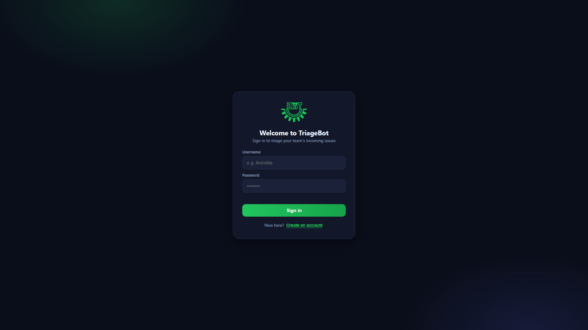
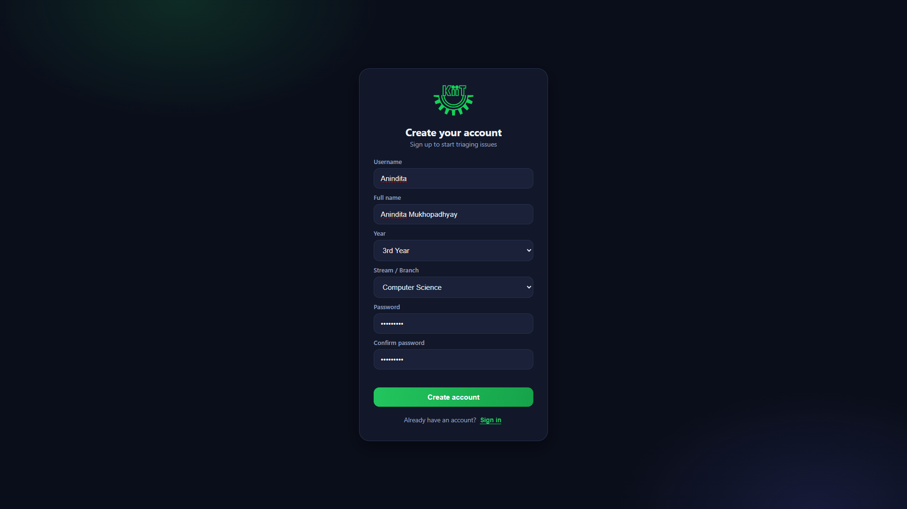
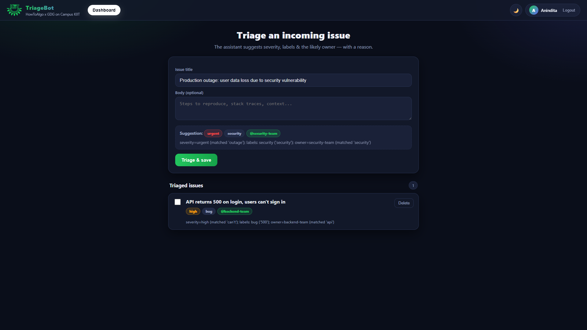
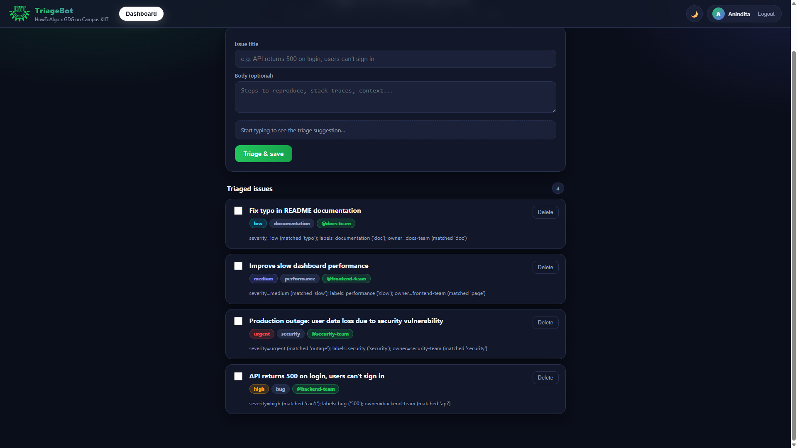
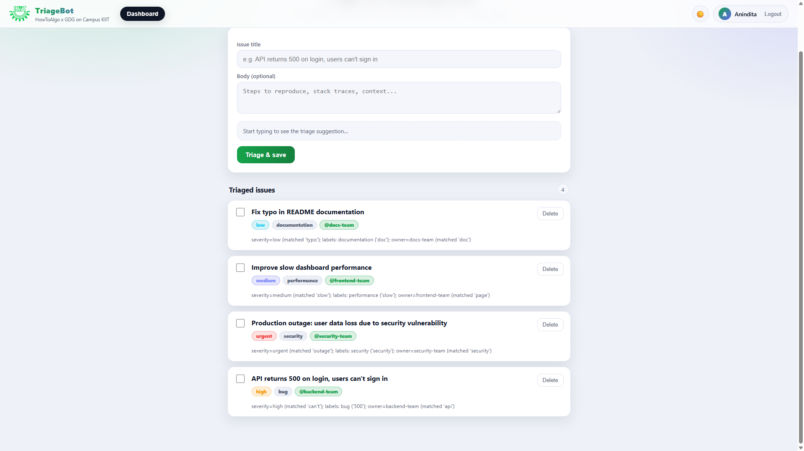

# TriageBot

> An incoming-issue triage assistant that suggests **severity**, **labels**, and
> the **likely owner** for each issue — with a human-readable reason for every
> decision.

**Hackathon:** Deploy or Die — HowToAlgo x GDG on Campus KIIT
**Track:** B — Developer Productivity Tools
**Example it implements:** *"A bug-triage assistant that reads incoming issues
and suggests labels, severity, and likely owners."*

---

## Why this project

Triaging incoming issues is repetitive, inconsistent, and easy to get wrong
under load. TriageBot reads an issue's title and body and instantly proposes:

- a **severity** (`low` / `medium` / `high` / `urgent`),
- one or more **labels** (`bug`, `documentation`, `enhancement`, `performance`,
  `security`, `chore`), and
- a **likely owner / team** (`frontend-team`, `backend-team`, `security-team`,
  `infra-team`, `docs-team`, …),

**plus an explanation** of exactly why. The engine is rule-based on purpose, so
it runs offline with **no API keys**, is fully deterministic, and every decision
is auditable and unit-tested.

## Demo / Screenshots

A quick visual tour of the app and the four triage severity cases it produces.

### Sign up & sign in

Accounts are created client-side (no server-stored passwords), then you land on
the triage dashboard.

| Sign in | Create account |
|---------|----------------|
|  |  |

### Live triage suggestion

As you type an issue title, TriageBot previews the suggested **severity**,
**labels**, and **owner** — each with a reason — before you save.



### All severity cases

The dashboard lists every triaged issue with colour-coded badges. The examples
below cover all four severity levels and the label/owner routing:

| Example issue | Severity | Labels | Owner |
|---------------|----------|--------|-------|
| *Production outage: user data loss due to security vulnerability* | `urgent` | `security` | `security-team` |
| *API returns 500 on login, users can't sign in* | `high` | `bug` | `backend-team` |
| *Improve slow dashboard performance* | `medium` | `performance` | `frontend-team` |
| *Fix typo in README documentation* | `low` | `documentation` | `docs-team` |



### Light theme

A built-in light / dark theme toggle:



## Quick start

```bash
# 1. Create and activate a virtual environment
python -m venv .venv
# Windows:  .\.venv\Scripts\activate
# Unix:     source .venv/bin/activate

# 2. Install dependencies
pip install -r requirements-dev.txt        # dev (tests + lint)
#   or: pip install -r requirements.txt     # runtime only

# 3. Run the app
uvicorn app.main:app --reload

# 4. Open the UI
#    http://127.0.0.1:8000
#    API docs (Swagger): http://127.0.0.1:8000/docs
```

## Try it

Web UI: type an issue title such as *"API returns 500 on login, users can't sign
in"* and watch the live suggestion. Or use the API:

```bash
curl -X POST http://127.0.0.1:8000/triage \
  -H "Content-Type: application/json" \
  -d '{"title": "Critical security outage in production", "body": "everything is down"}'
```

```json
{
  "severity": "urgent",
  "labels": ["security"],
  "owner": "security-team",
  "reason": "severity=urgent (matched 'outage'); labels: security ('security'); owner=security-team (matched 'security')"
}
```

## API reference

| Method | Path | Description |
|--------|------|-------------|
| `GET`  | `/health` | Liveness probe. |
| `POST` | `/triage` | Triage an issue **without** saving it. |
| `POST` | `/triage/batch` | Triage a list of issues at once. |
| `POST` | `/issues` | Triage **and** store an issue. |
| `GET`  | `/issues` | List stored issues (newest first). |
| `GET`  | `/issues/{id}` | Fetch one issue. |
| `PATCH`| `/issues/{id}` | Update an issue (re-triages if title/body change). |
| `DELETE`| `/issues/{id}` | Delete an issue. |
| `GET`  | `/` | Web UI. |

## Architecture

```
                 HTTP + Web UI
                      │
              ┌───────▼────────┐
              │   app/main.py  │   FastAPI routes (thin)
              └───────┬────────┘
          ┌───────────┴───────────┐
   ┌──────▼───────┐        ┌──────▼─────────┐
   │ app/triage.py│        │ app/repository │  SQLite data access
   │ (pure logic) │        └──────┬─────────┘
   │ severity /   │               │
   │ labels /     │        ┌──────▼─────────┐
   │ owner + why  │        │ app/database.py│  connection + schema
   └──────────────┘        └────────────────┘
```

- **`app/triage.py`** — the engine. Pure functions, no I/O, no framework. All
  behaviour is driven by three ordered keyword tables (severity, labels, owner).
  This is what makes the tool deterministic and trivially testable.
- **`app/repository.py`** — SQLite persistence, one query per function.
- **`app/schemas.py`** — Pydantic models = the API contract and input validation.
- **`app/main.py`** — wires it together and serves the UI.

## Testing & verification

```bash
ruff check .   # lint — must be clean
pytest         # 25 tests: engine logic + full HTTP API
```

- `tests/test_triage.py` — engine rules (severity ordering, multi-label, owner
  routing, defaults, explainability).
- `tests/test_api.py` — end-to-end API behaviour against an isolated temp DB.

## CI/CD

[`.github/workflows/ci.yml`](.github/workflows/ci.yml) runs on every push and
pull request:

1. **Lint & Test** across Python 3.11 / 3.12 / 3.13 (`ruff check .` then `pytest`).
2. **Smoke** job that installs runtime deps and verifies the app imports and
   constructs.

## Deployment (public URL)

The repo ships a [`render.yaml`](render.yaml) blueprint so the app can run 24/7
on a free [Render](https://render.com) web service:

1. Sign in to Render with GitHub.
2. **New → Blueprint**, pick the `triagebot` repo → **Apply**. Render reads
   `render.yaml` and provisions a free web service.
3. You get a fixed public URL like `https://triagebot.onrender.com`, and every
   push to `main` auto-redeploys.

The server binds to Render's `$PORT` (`uvicorn app.main:app --host 0.0.0.0
--port $PORT`) and exposes `/health` for Render's health checks.

> Note: the free plan sleeps after ~15 min of inactivity (first request then
> cold-starts in ~30s), and its filesystem is ephemeral — the SQLite data resets
> on redeploy/restart, which is fine for a demo.

## Project layout

```
KIIT/
├── app/
│   ├── triage.py         # rule-based triage engine (pure logic)
│   ├── repository.py     # SQLite data access
│   ├── database.py       # connection + schema
│   ├── schemas.py        # Pydantic API models
│   └── main.py           # FastAPI app + routes
├── static/index.html     # web UI
├── docs/screenshots/     # demo screenshots (used in this README)
├── tests/                # pytest suite
├── .github/workflows/    # CI/CD
├── requirements.txt      # runtime deps
├── requirements-dev.txt  # + tests & lint
└── pyproject.toml        # tooling config (pytest, ruff)
```

## License

MIT — see [`LICENSE`](LICENSE).
